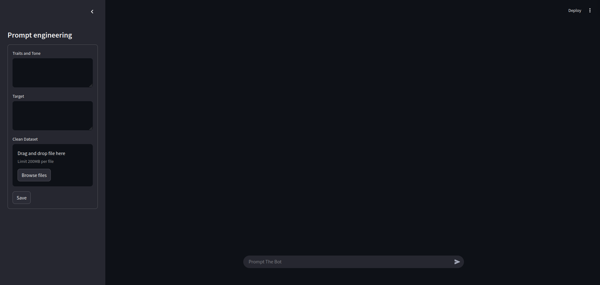
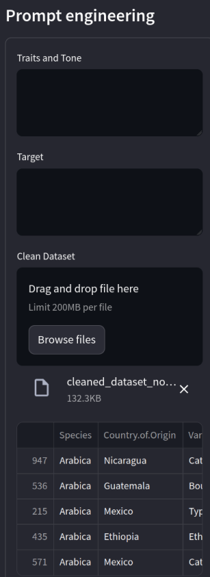

# ML-coffee-quality

https://www.pactcoffee.com/blog/speciality-coffee-quality-scores-explained

https://www.kaggle.com/datasets/volpatto/coffee-quality-database-from-cqi

https://ollama.com/library/qwen3

## Part 1: Data Analysis With Jupyter Notebook

As programmers, coffee arguably play a major role in our daily diet, and is something we see as a way to both treat ourselves (and possibly to function at all).

We therefore decided to do an analysis of coffee bean quality, with the goal of hopefully gaining better understanding about what makes a good coffee.

Our dataset is from Kaggle, but originates from the CQI (California Quality Institue) database which is a recognised intitution for judging coffee bean quality within standardised scores. It consists of around 1300 rows of both Robusta and Arabica beans from all over the world, which where judged in spring 2023.

We have created 3 notebooks, where we conduct the analysis from cleaning the dataset, exploring and model training for predicting scores based on flavor parameters.

The individual analysises is are found in the directories by their name:

`data_cleaned/`

`clustering/`

`random_forrest/`

Pdf versions of the individual and merged analysises are found in:

`pdf/`

## Part 2: Streamlit LLM chatroom 

The prompt template system used for feeding tabular data to a local LLM via Ollama.
A prerequisite for running the application is having a local ollama instance with Qwen3:8b
installed and listining on the default Ollama API port.

Development is documented in: `pdf/ML_part2.pdf`

---

**Step 1: Clone the repository**

git clone https://github.com/NatasjaVitoft/ML-coffee-quality

**Step 2: Create and activate enviroment**

python -m venv venv
.\venv\Scripts\activate

**Step 3: Install requiremnts**

pip install -r requirements.txt

**Step 4: Run streamlit app**

streamlit run streamlit/app.py

---

## Usage

Upload the data youre interested in having a conversation about.
Data should be uploaded in CSV format (e. g exported to CSV from pandas), and it should pereferably be numerical data.

The app will then calculate descriptive statistics, correlation matrices and insert it in a prompt template.
You can add other prompt engineering traits:
The traits are the perspective the LLM should assume, and the target is whom it should address.

Now you can ask questions about the dataset, and it will get formatted into the context of the prompt template.
Now you can ask questions about the dataset, and it will get formatted into the context of the prompt template.

